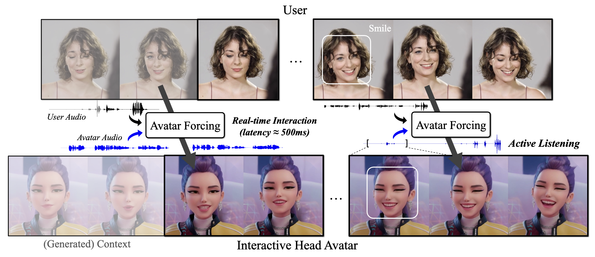

# Avatar Forcing: Real-Time Interactive Head Avatar Generation for Natural Conversation
Official Pytorch Implementation of Avatar Forcing; Motion Latent Diffusion Forcing for Interactive Head Avatar Generation



## Avatar Forcing: Real-Time Interactive Head Avatar Generation for Natural Conversation

[Taekyung Ki<sup>1</sup>*](https://taekyungki.github.io), &nbsp; [Sangwon Jang<sup>1</sup>*](https://agwmon.github.io/), &nbsp; [Jaehyeong Jo<sup>1</sup>](https://harryjo97.github.io/), &nbsp; [Jaehong Yoon<sup>2</sup>](https://jaehong31.github.io/), &nbsp;[Sung Ju hwang<sup>1,3</sup>](http://www.sungjuhwang.com/)

<sup>1</sup>KAIST &nbsp; &nbsp; <sup>2</sup>NTU Singapore &nbsp; &nbsp; <sup>3</sup>DeepAuto.ai &nbsp; &nbsp; &nbsp; &nbsp; <sup>*</sup>Equal contribution

[](https://taekyungki.github.io/AvatarForcing/)
[](https://arxiv.org/abs/2601.00664v1)

Code will be released soon.

## Abstract
Talking head generation creates lifelike avatars from static portraits for virtual communication and content creation. However, current models do not yet convey the feeling of truly interactive communication, often generating one-way responses that lack emotional engagement. We identify two key challenges toward truly interactive avatars: generating motion in real-time under causal constraints and learning expressive, vibrant reactions without additional labeled data. To address these challenges, we propose Avatar Forcing, a new framework for interactive head avatar generation that models real-time user-avatar interactions through diffusion forcing. This design allows the avatar to process real-time multimodal inputs, including the user's audio and motion, with low latency for instant reactions to both verbal and non-verbal cues such as speech, nods, and laughter. Furthermore, we introduce a direct preference optimization method that leverages synthetic losing samples constructed by dropping user conditions, enabling label-free learning of expressive interaction. Experimental results demonstrate that our framework enables real-time interaction with low latency (approximately 500ms), achieving 6.8X speedup compared to the baseline, and produces reactive and expressive avatar motion, which is preferred over 80% against the baseline.


## Citation
```
@article{ki2026avatar,
    title={Avatar Forcing: Real-Time Interactive Head Avatar Generation for Natural Conversation},
    author={Ki, Taekyung and Jang, Sangwon and Jo, Jaehyeong and Yoon, Jaehong and Hwang, Sung Ju},
    journal={arXiv preprint arXiv:2601.00664},
    year={2026}
}
```